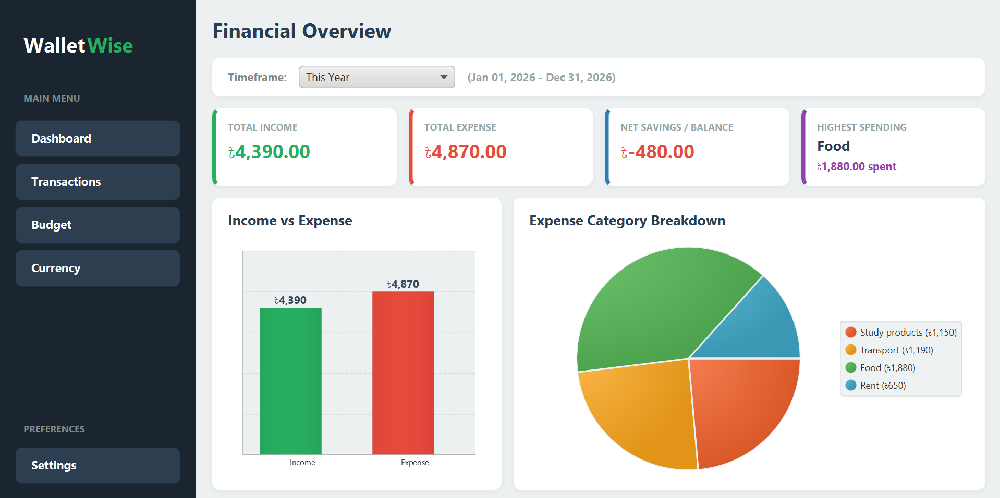

# 💰 WalletWise — Personal Finance Manager

**WalletWise** is a desktop personal finance management application built with **Java, JavaFX, SQLite, and Maven**.

It allows users to manage income and expenses, create budgets, monitor financial activity, convert currencies, import/export transaction data, and generate PDF reports.

The project was developed as an academic Java application demonstrating **OOP, JavaFX, databases, multithreading, HTTP networking, JSON processing, and file handling**.

---

## ✨ Features

### 📊 Dashboard

- View income, expenses, and balance
- Bar chart for cash flow
- Pie chart for expense distribution
- Filter data by week, month, year, or custom date range
- Responsive layout

### 💸 Transactions

- Add, edit, and delete transactions
- View transaction history
- Search and filter transactions
- Categories and descriptions
- Full CRUD operations using SQLite

### 🎯 Budget Planner

- Create monthly category budgets
- Track spending against budgets
- Visual progress indicators

### 💱 Currency Exchange

- Convert between currencies
- Fetch live exchange rates using an HTTP API
- Local saved rates and fallback rates when the API is unavailable

### 🔒 Security & Backup

- Optional application lock with SHA-256 hashed passcode
- Passcode verification for security-sensitive actions
- Automatic SQLite database backups
- Application reset with passcode confirmation

### 📄 Import & Export

- Import and export transactions using JSON
- Duplicate transaction protection
- Currency consistency checking
- Generate PDF financial reports

### 🚀 Welcome Setup

On first launch, users can:

- Select their preferred currency
- Create or skip an application passcode
- Enable or disable automatic backups

The setup guide also appears after a complete application reset.

---

## 🖥️ Screenshots

### Welcome Guide


### Dashboard



### Budget Planner


### Currency Exchange


### Transaction History


### Settings


---

## 🛠️ Technologies

| Technology          | Purpose                |
| ------------------- | ---------------------- |
| **Java 17+**        | Core programming       |
| **JavaFX / FXML**   | Desktop GUI            |
| **SQLite / JDBC**   | Database and CRUD      |
| **Maven**           | Build and dependencies |
| **Jackson**         | JSON processing        |
| **OpenPDF**         | PDF generation         |
| **Java HttpClient** | HTTP requests          |

---

## 🧠 Concepts Demonstrated

### Object-Oriented Programming

- Classes and objects
- Encapsulation
- Inheritance
- Polymorphism
- Abstract classes
- Interfaces
- Generics

### JavaFX

- FXML-based UI
- Layouts such as `BorderPane`, `StackPane`, `VBox`, and `HBox`
- Tables, forms, charts, buttons, and progress bars
- Responsive layouts and property binding

### Multithreading

- `CompletableFuture`
- Thread pools
- Background processing
- `Platform.runLater()`

Background processing is used for operations such as HTTP requests so the JavaFX interface remains responsive.

### Database

- SQLite
- JDBC
- Primary and foreign keys
- Relationships
- Prepared statements
- CRUD operations
- DAO pattern

### Networking & JSON

- Java `HttpClient`
- HTTP API requests
- Jackson JSON parsing
- JSON import/export
- Exchange-rate caching

### Other

- File handling
- Exception handling
- PDF report generation
- SHA-256 hashing

---

## 📁 Project Structure

```text
walletWise-JavaFX/
│
├── Images/
│   ├── Budget Planner.png
│   ├── Currency Exchange.png
│   ├── Settings 01.png
│   ├── Settings 02.png
│   ├── Transaction History.png
│   └── Welcome window.png
│
├── Sample Transaction Data in json for quick import/
│
├── walletWise/
│   ├── src/
│   │   └── main/
│   │       ├── java/
│   │       │   └── com.walletwise/
│   │       │       │
│   │       │       ├── controller/
│   │       │       │   ├── BudgetController.java
│   │       │       │   ├── CurrencyController.java
│   │       │       │   ├── DashboardController.java
│   │       │       │   ├── LoginController.java
│   │       │       │   ├── MainController.java
│   │       │       │   ├── SettingsController.java
│   │       │       │   ├── TransactionFormController.java
│   │       │       │   ├── TransactionsController.java
│   │       │       │   └── WelcomeGuideController.java
│   │       │       │
│   │       │       ├── dao/
│   │       │       │   ├── BudgetDAO.java
│   │       │       │   ├── CategoryDAO.java
│   │       │       │   ├── DatabaseInitializer.java
│   │       │       │   ├── GenericDAO.java
│   │       │       │   ├── SettingsDAO.java
│   │       │       │   └── TransactionDAO.java
│   │       │       │
│   │       │       ├── model/
│   │       │       │   ├── BaseEntity.java
│   │       │       │   ├── Budget.java
│   │       │       │   ├── Category.java
│   │       │       │   └── Transaction.java
│   │       │       │
│   │       │       ├── service/
│   │       │       │
│   │       │       ├── util/
│   │       │       │
│   │       │       ├── Launcher.java
│   │       │       └── Main.java
│   │       │
│   │       └── resources/
│   │           ├── fxml/
│   │           │   ├── BudgetLayout.fxml
│   │           │   ├── CurrencyLayout.fxml
│   │           │   ├── DashboardLayout.fxml
│   │           │   ├── LoginLayout.fxml
│   │           │   ├── MainLayout.fxml
│   │           │   ├── SettingsLayout.fxml
│   │           │   ├── TransactionForm.fxml
│   │           │   ├── TransactionsLayout.fxml
│   │           │   └── WelcomeGuideLayout.fxml
│   │           │
│   │           └── images/
│   │
│   ├── backups/
│   ├── pom.xml
│   └── walletwise.db
│
├── exchange_rates_cache.json
├── walletwise.db
└── README.md
```

### Main Packages

| Package          | Purpose                                                       |
| ---------------- | ------------------------------------------------------------- |
| `controller`     | Handles JavaFX UI events and user interaction                 |
| `dao`            | Handles SQLite database operations and CRUD                   |
| `model`          | Contains application data classes                             |
| `service`        | Contains application/business logic and background operations |
| `util`           | Contains reusable utility classes                             |
| `resources/fxml` | Contains JavaFX UI layouts                                    |

---

## 🗄️ Database

WalletWise uses a local SQLite database:

```text
walletwise.db
```

The application automatically initializes the required tables and uses JDBC for database operations.

The DAO layer separates database operations from the JavaFX controllers.

---

## 📦 Sample Data

Sample transaction JSON files are included in:

```text
Sample Transaction Data in json for quick import/
```

They can be imported into WalletWise to quickly test the application.

---

## 🚀 How to Run

### Prerequisites

- **JDK 17 or later**
- **Maven**
- **Git**
- **IntelliJ IDEA** (recommended)

### Clone the Repository

```bash
git clone https://github.com/abdussamadcodes/walletWise-JavaFX.git
cd walletWise-JavaFX
```

### Open the Project

Open the `walletWise-JavaFX` directory in **IntelliJ IDEA** as a Maven project.

### Load Maven Dependencies

After opening the project:

1. Open the **Maven** panel in IntelliJ IDEA.
2. Click **Reload All Maven Projects** to download and load the dependencies defined in `pom.xml`.
3. Wait until Maven finishes importing the dependencies.

### Run the Application

There are two ways to run WalletWise.

#### Option 1 — Run using Maven

1. Open the **Maven** panel.
2. Expand the project.
3. Go to **Plugins → javafx**.
4. Run the **`javafx:run`** goal.

This starts the JavaFX application using the dependencies configured in `pom.xml`.

#### Option 2 — Run the Launcher class

1. Open the project's **`Launcher.java`** class.
2. Click the **Run ▶** button next to the `main()` method or class.
3. IntelliJ IDEA will launch the application.

> **Note:** If the project has just been cloned, make sure Maven dependencies have been loaded successfully before running the application.

---

## 🎓 Academic Focus

WalletWise demonstrates practical use of:

**Java & OOP** → Classes, inheritance, interfaces, generics, polymorphism
**JavaFX & FXML** → Desktop GUI and responsive layouts
**SQLite & JDBC** → Relational database and CRUD
**Multithreading** → Background processing and thread pools
**HTTP & JSON** → Live currency exchange API
**File Handling** → JSON import/export and backups
**OpenPDF** → Financial reports

---

## 👨‍💻 Author

**Md. Abdus Samad**
Department of Computer Science & Engineering
**Khulna University of Engineering & Technology (KUET)**

GitHub: [@abdussamadcodes](https://github.com/abdussamadcodes)

---

## 📄 License

This project was developed for **academic purposes**.
